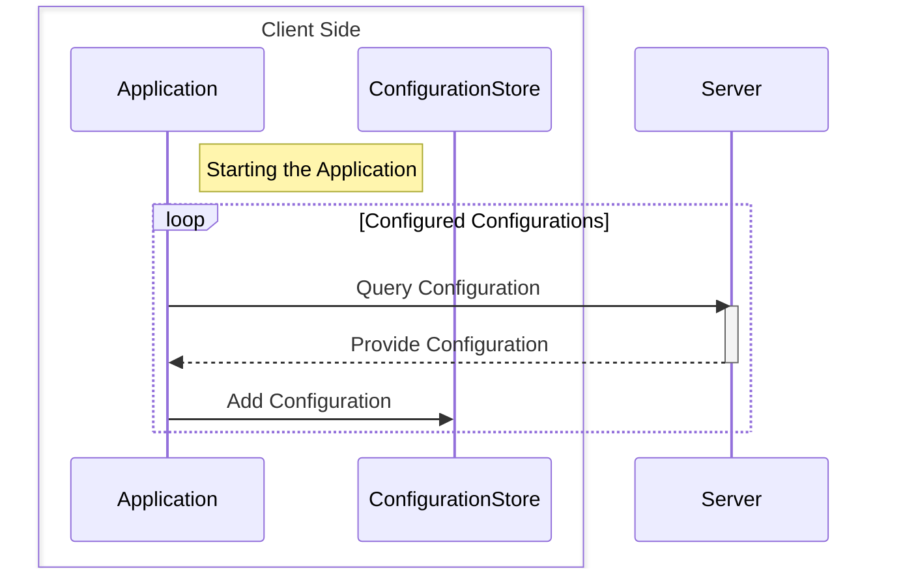
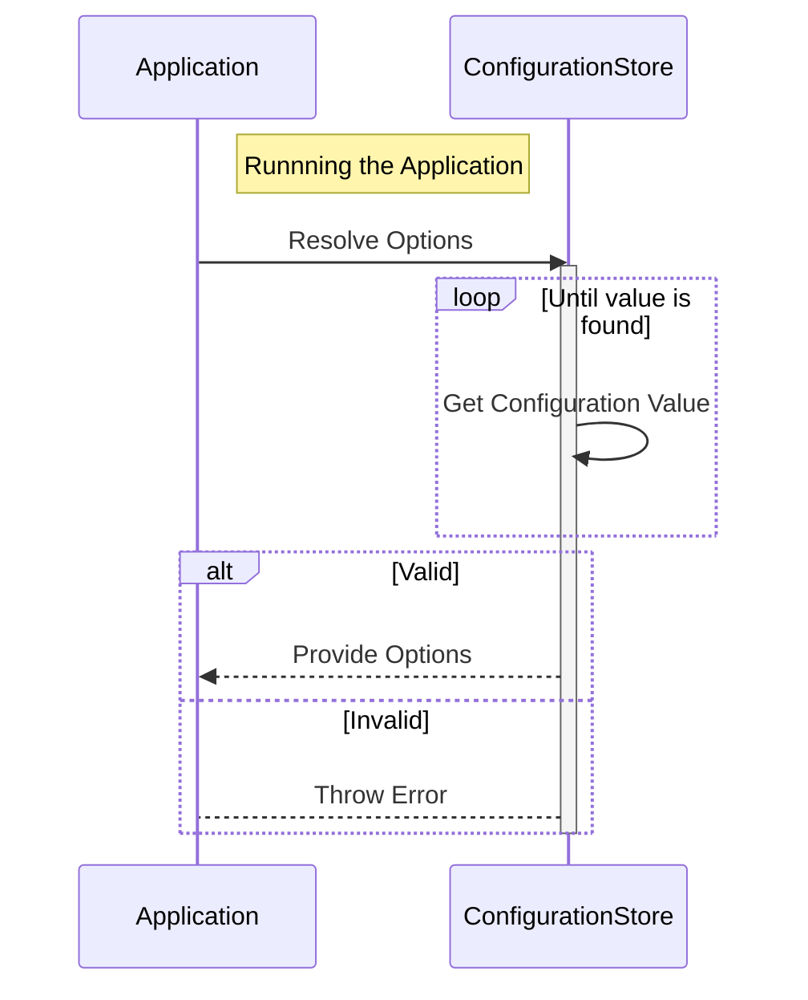

# ngx-configuration
The `ngx-configuration` packages provide ease-to-use solution for handling configuration in [Angular](https://angular.dev) webapplications.

With the help of the `ngx-configuration-core` package the application configurations can be injected to the application. Also capable to handle different settings for different environments (Production, Development...).</br>
The `ngx-configuration-options` package is capable to map different sections of the red configuration to separated objects, validate the configurations and inject the neccessary configurations to the dependent services.

[](https://sonarcloud.io/summary/new_code?id=mihben_ngx-configuration)

## Workflow
### Loading Configurations


### Resolve Options

    

## Getting Started
1. Install packages:
```bash
npm install ngx-configuration-core;
npm install ngx-configuration-options;
```

2. Registrate configurations and options in `app.config.ts`:
```javascript
providers: [
    ...
    provideConfiguration(builder => builder.registerJson(builder, #ENVIRONMENT#)),
    provideOptions(#OPTIONS_TYPE#, builder => builder.bind('#CONFIGURATION_SECTION#').
    ...
]
```

### Sample
`apsettings.json` as asset:
```json
{
    "Backend": {
        "BaseAddress": "https://backend.com/",
        "Path": "api"
    }
}
```

Declaration of `BackendOptions`:
```javascript
export interface BackendOptions {
    required()
    baseAddress: string;
    required()
    path: string;
}
```

Registrations in `app.config.ts`:
```javascript
providers: [
    ...
    providerConfiguration(builder => builder.registerJson('appsettings.json')),
    providerOptions(BackendOptions, builder => builder.bind("Backend")),
    ...
]
```

## Tutorials
Tutorials can be found [here]().

## Sample Code

## Licence
**MIT**